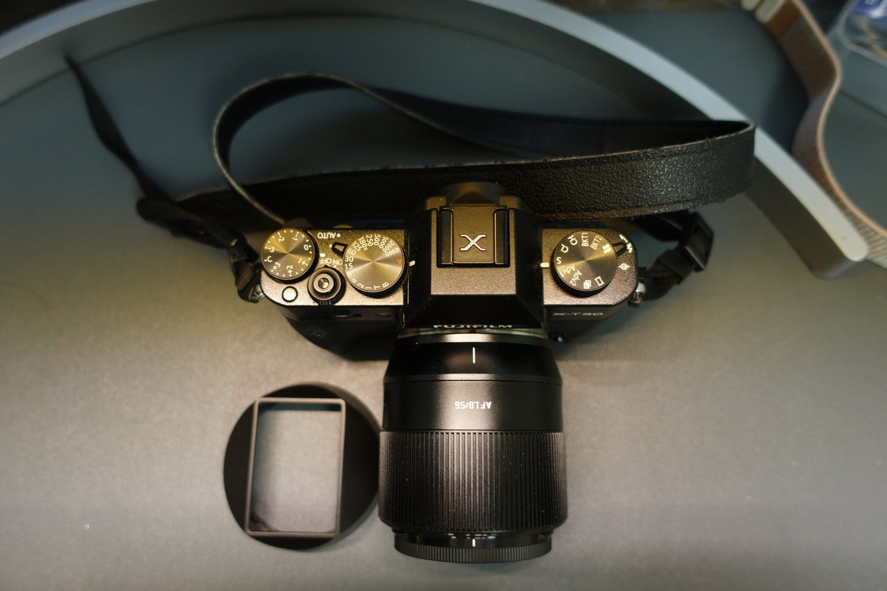
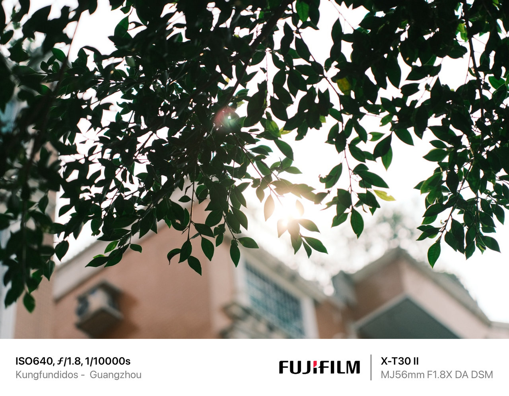

## Introduction

Chinese lens manufacturers are stepping up their game, and the current offering of autofocus lenses was unthinkable 5 years ago. TTartisan has provided me with their TTartisan AF 56mm F1.8 to test it on the streets of Guangzhou. I find this lens quite interesting, although in this focal range we already have several alternatives from Sigma, Meike, or the wonderful Fuji XF56 F1.2 (though this one is quite more expensive).

It's important to mention that I'm not a professional photographer, I'm simply a street photography enthusiast, so don't expect a very technical review, but rather an honest exploration of how this lens adapts to my needs as a street photographer. After all, those who need maximum quality and sharpness for work or hobby will always end up buying a "native" lens instead of opting for more economical options. Can this lens meet my needs in the demanding streets of China?

## Build and Design (3.5/5)

My first impression of the TTArtisan AF 56mm F1.8 is that it seems robust and relatively compact. With dimensions of 65mm in diameter and 62mm in length, the TTArtisan AF 56mm F1.8 sits in a quite acceptable size range for a 56mm lens. However, it's impossible to achieve something as compact as the Fuji XF50 f2. Additionally, it's not a very heavy lens, weighing 236g, so it shouldn't cause hand fatigue.

A notable aspect of the TTArtisan AF 56mm F1.8 is its metal construction, unlike other manufacturers like Viltrox, who have opted for plastic in their more economical lenses. This adds a quality plus, giving a feeling of greater durability and solidity in hand.

The manual focus ring feels very comfortable, with quite good tactile feedback. It doesn't have a switch to change from autofocus to manual focus, but I don't see this as a major problem since most Fuji cameras have this switch on the camera body.

But I do see a problem in the lack of an aperture ring. I think many of us choose Fuji cameras for their manual controls, and for me, this point is key - you lose a lot of usability, especially when doing street photography.

## Autofocus (4/5)

The TTArtisan AF 56mm F1.8 offers quite good autofocus, although coming from the 23mm F2, I've noticed some shortcomings. While focus speed is fast, it's slightly slower than Fuji lenses, and I've noticed some focus hunting, especially in low light conditions.

## Image Quality and Optical Performance: (4/5)

The image quality offered by the TTArtisan AF 56mm F1.8 is impressive, exceeding my expectations, especially considering its price. During my tests in the bustling streets of Guangzhou, I was impressed with the center sharpness even at f1.8.

## BOKEH

The bokeh performance of this lens is quite uniform, with minimal distortion, resulting in pleasant and aesthetically appealing bokeh. However, it can become a bit nervous at long distances. Perhaps for some, this might be a positive point.

## Conclusions

After spending time with the lens in the streets of Guangzhou, I feel I've found a new photography companion, at least temporarily. I'm not an expert, but as I said, this lens has exceeded my expectations.

It's clear that this lens offers very good performance in all types of situations, although it might be slightly weak for product photography. It combines good focus, excellent image quality, and a spectacular price. For photographers looking for a good, beautiful, and affordable lens, the TTArtisan AF 56mm F1.8 is an option worth considering.