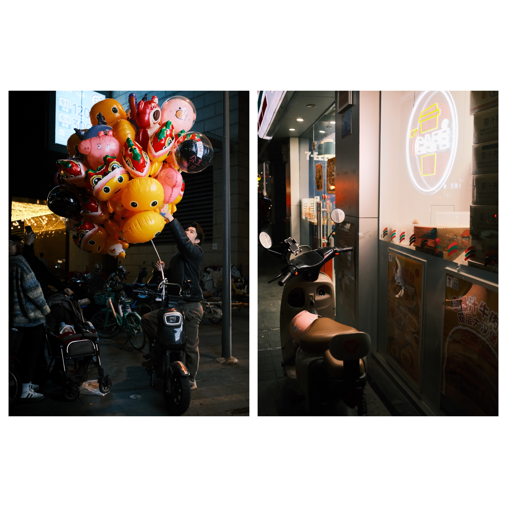
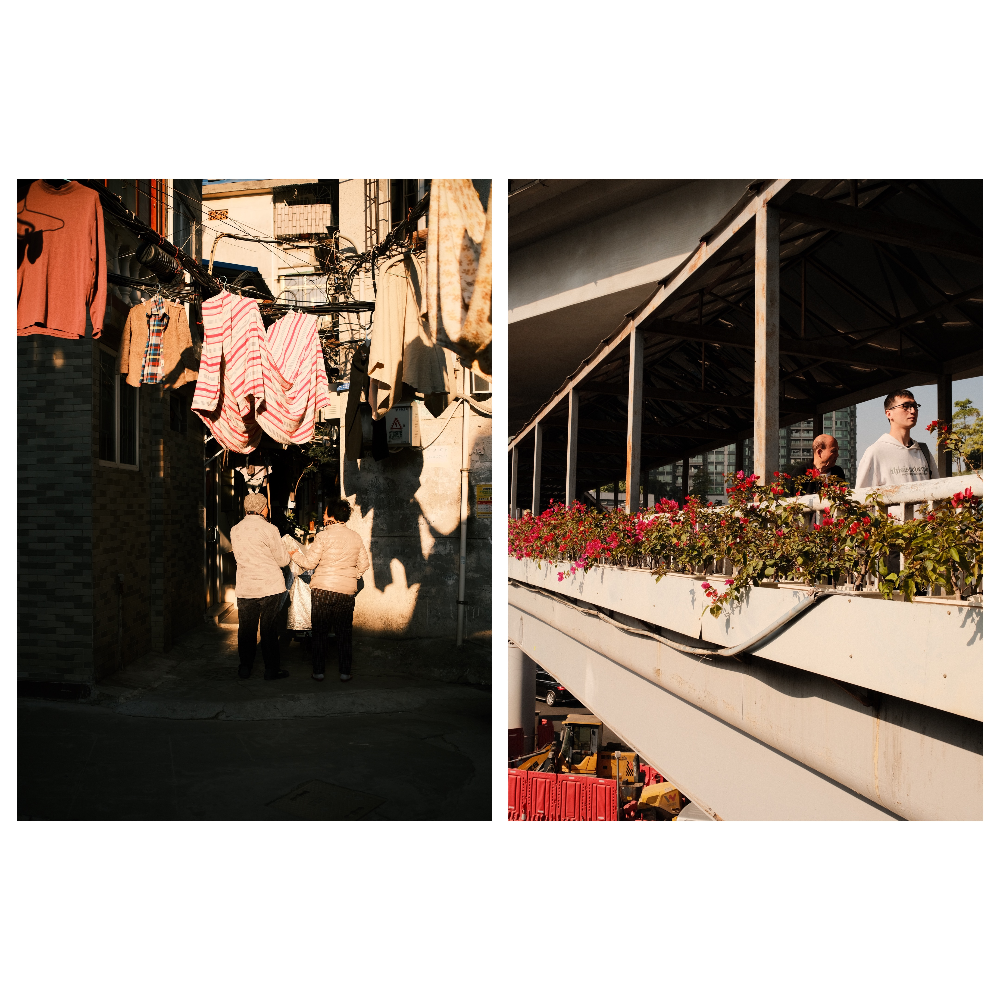

## Introducción

Como fotógrafo callejero amateur que ha estado usando este objetivo durante las últimas semanas, quiero compartir mi experiencia sincera con el TTArtisan AF 23mm f/1.8. En fotografía callejera, el 35mm (equivalente a 23mm en APS-C) siempre ha sido una focal de referencia. Y TTArtisan ha entrado en este espacio con su nuevo AF 23mm f/1.8, un objetivo que por 127 euros promete hacer más accesible esta focal clásica para fotógrafos con presupuesto limitado. Mis expectativas eran moderadas especialmente porque venía de usar el Fujinon XF 23mm f/2. Sin embargo, este pequeño objetivo me ha sorprendido gratamente en varios aspectos, aunque también tiene unas limitaciones que vale la pena mencionar.

## Construcción y diseño (3.5/5)

La construcción metálica del objetivo ofrece una sensación de solidez que supera las expectativas para su rango de precio. Su diseño compacto y peso ligero de 210g lo convierten en un compañero ideal para fotografía callejera y uso diario. La ausencia de anillo de apertura es el punto más negativo que le encuentro a este objetivo, ya que puede ser un punto de adaptación para usuarios habituados a objetivos Fujifilm, pero esto permite mantener un precio más contenido.

El parasol incluido, aunque inicialmente me gustaba menos que el del TTArtisan AF 56mm f/1.8, cumple su función protectora adecuadamente. El diámetro de filtro de 52mm es un acierto, permitiendo compartir filtros con otros objetivos de la marca como el AF 56mm f/1.8.

## Autoenfoque (4/5)

Durante mis paseos por las ciudades de Guangzhou y Macao, el enfoque automático ha resultado ser más que competente, quizá un poco por debajo del TTArtisan AF 56mm F1.8. Está claro que no llega al nivel de los objetivos nativos de Fujifilm pero es precio y muy silencioso, importante si quieres intentar pasar desapercibido en la calle. He perdido algunos momentos debido a que el enfoque ocasionalmente me ha fallado en situaciones de poca luz, pero esto sucede menos de lo que esperaba en un principio.

## Calidad de Imagen y Rendimiento Óptico: (4/5)

En cuanto al rendimiento óptico, el TTArtisan 23mm f/1.8 ofrece resultados notables, especialmente considerando su precio. Las imágenes que produce tienen un carácter especial. La nitidez en el centro de la imagen es muy buena incluso a la apertura máxima de f/1.8. Sin embargo, las esquinas de la imagen suelen ser más suaves en aperturas amplias, pero mejoran significativamente al cerrar el diafragma a f/5.6 o f/8, aunque honestamente, en fotografía callejera rara vez son cruciales.

## Viñeteo y aberraciones cromáticas

El viñeteo es notable a f/1.8, lo que muchos consideran una limitación; sin embargo a mí personalmente me gusta este efecto que puede ser utilizado creativamente en fotografía callejera o retratos ambientales. De todas formas el viñeteo disminuye al cerrar el diafragma. La aberración cromática está muy bien controlada, con poca o ninguna franja de color visible en las imágenes. El rendimiento a contraluz es aceptable, con algunos destellos y reflejos controlados, lo cual es un punto muy positivo para un lente de esta gama de precio.

## BOKEH

Tiene un carácter peculiar, es un poco "nervioso", lo que puede añadir un toque artístico a las imágenes, como el de los objetivos vintage.

## Lo Que Me Gusta
- El precio es imbatible para lo que ofrece
- La construcción metálica me da confianza en uso diario
- El enfoque automático es silencioso, perfecto para fotografía discreta
- La nitidez en el centro es más que suficiente para mi uso

## Lo Que Podría Mejorar
- El enfoque automático puede dudar en condiciones de poca luz
- Las esquinas son notablemente más suaves que el centro
- Echo de menos tener un anillo de apertura físico

## Reflexión Final

Puedo decir que el TTArtisan 23mm f/1.8 ha cambiado mi perspectiva sobre los objetivos económicos. No, no es perfecto - tiene sus limitaciones y características particulares. Pero por 127 euros, ofrece una experiencia fotográfica que antes solo era posible con objetivos mucho más caros.

Para fotógrafos callejeros principiantes o aquellos que buscan una segunda óptica sin gastar mucho, este objetivo es una opción muy válida. Sus defectos son manejables y, en algunos casos, pueden incluso darle una estética diferente a tus fotos. ¿Puede reemplazar a una óptica premium como el XF23mm? No. Pero tampoco creo que ese sea su propósito ya que el XF23 cuesta casi 4 veces más. Lo que hace es permitir que más personas puedan explorar esta distancia focal clásica sin hipotecar su equipo. Y por eso, creo que merece una seria consideración.