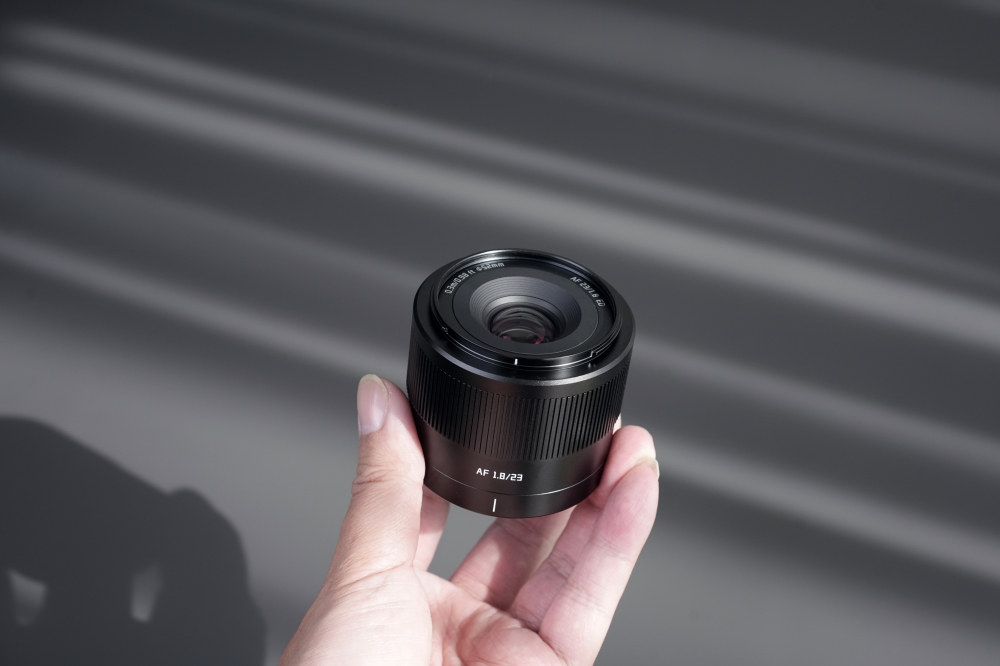

## Introducción

En los últimos años, los objetivos con enfoque automático de marcas chinas han mejorado mucho, y el TTArtisan AF 23mm f/1.8 es un claro ejemplo de ello. Este objetivo, con un precio de alrededor de 127 euros, ofrece una focal clásica de 23mm (equivalente a 35mm en formato completo), que es muy popular entre los fotógrafos callejeros. Como fotógrafo amateur, venía de usar el Fujinon XF 23mm f/2, así que mis expectativas eran moderadas, pero este pequeño objetivo me sorprendió en varios aspectos. A continuación, te cuento mi experiencia al usarlo en las calles de Guangzhou y Macao.

## Construcción y diseño (3.5/5)

El TTArtisan AF 23mm F1.8 tiene una construcción metálica que me dio una sensación de solidez inesperada para un objetivo de este precio. Con un peso de solo 210 g y un diseño compacto, es perfecto para fotografía callejera, donde el tamaño y el peso son cruciales. Sin embargo, echo de menos un anillo de apertura, algo que muchos fotógrafos, especialmente los que usan cámaras Fuji, apreciarán.

El parasol que viene incluido es funcional, pero no tan sofisticado como el del TTArtisan AF 56mm f/1.8. A pesar de esto, cumple bien su tarea, y el diámetro de filtro de 52mm es un acierto, ya que te permite compartir filtros con otros objetivos de la marca.

## Rendimiento óptico (4/5)

En términos de calidad de imagen, este objetivo me ha impresionado bastante. Las imágenes son nítidas en el centro, incluso con la apertura máxima de f/1.8. Las esquinas pueden ser un poco más suaves, pero en mi estilo de fotografía callejera esto no suele ser un problema importante, ya que rara vez hago tomas donde las esquinas sean decisivas.

### Viñeteo y aberraciones

El viñeteo es evidente a f/1.8, lo que podría considerarse una limitación, pero a mí me gusta este efecto, especialmente en la fotografía callejera o los retratos ambientales, ya que añade un toque artístico. Al cerrar el diafragma, el viñeteo disminuye, lo que mejora la imagen. La aberración cromática también está muy bien controlada, y apenas he notado franjas de color en mis fotos, incluso en contraluces.

### Bokeh

El bokeh del TTArtisan AF 23mm F1.8 tiene un carácter peculiar. Es un tanto "nervioso", lo que puede no ser del gusto de todos, pero personalmente me gusta cómo añade un toque retro y artístico a las imágenes, algo que me recuerda a los objetivos vintage.

## Sistema de enfoque (4/5)

El enfoque automático de este objetivo ha sido bastante bueno en la mayoría de mis pruebas. Aunque no es tan rápido como los objetivos nativos de Fuji, es silencioso y bastante preciso. A veces, en condiciones de poca luz, ha dudado un poco, pero esto es algo que ocurre con muchos objetivos de este rango de precio. Lo importante es que, en general, ha sido un enfoque confiable y rápido para mi estilo de fotografía callejera.

## Lo que me gusta
- El precio es imbatible para la calidad que ofrece.
- La construcción metálica transmite confianza y solidez.
- El enfoque automático es silencioso, ideal para pasar desapercibido.
- La nitidez en el centro es excelente, incluso a f/1.8.

## Lo que podría mejorar
- El enfoque automático puede fallar en condiciones de poca luz.
- Las esquinas son más suaves que el centro, aunque esto no es un gran problema para la fotografía de calle.
- Echo de menos un anillo de apertura físico, algo muy útil para los usuarios de Fuji.

## Reflexión final

El TTArtisan AF 23mm F1.8 ha cambiado mi perspectiva sobre los objetivos económicos. No es perfecto, pero por el precio que tiene, ofrece una experiencia fotográfica de calidad que antes solo se podía obtener con objetivos mucho más caros. Para fotógrafos callejeros o aquellos que buscan una segunda óptica sin gastar mucho, este objetivo es una excelente opción.

Si bien no reemplazará a un objetivo premium como el Fujinon XF 23mm f/2, su precio lo hace accesible a un público mucho más amplio, permitiendo que más personas exploren esta focal clásica sin tener que gastar una fortuna. Por eso, creo que es una opción muy válida y merece una seria consideración.