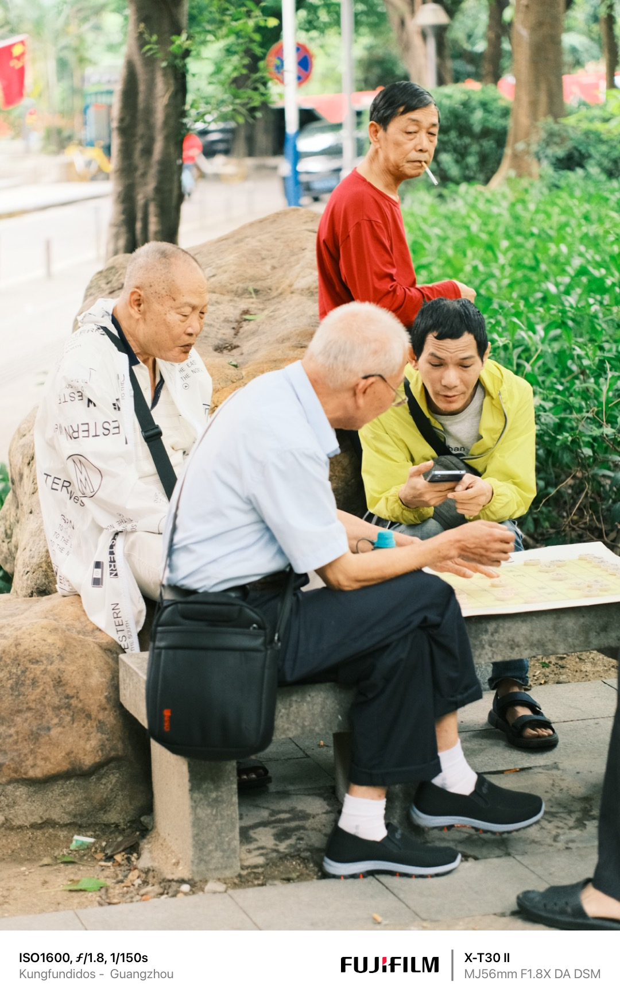
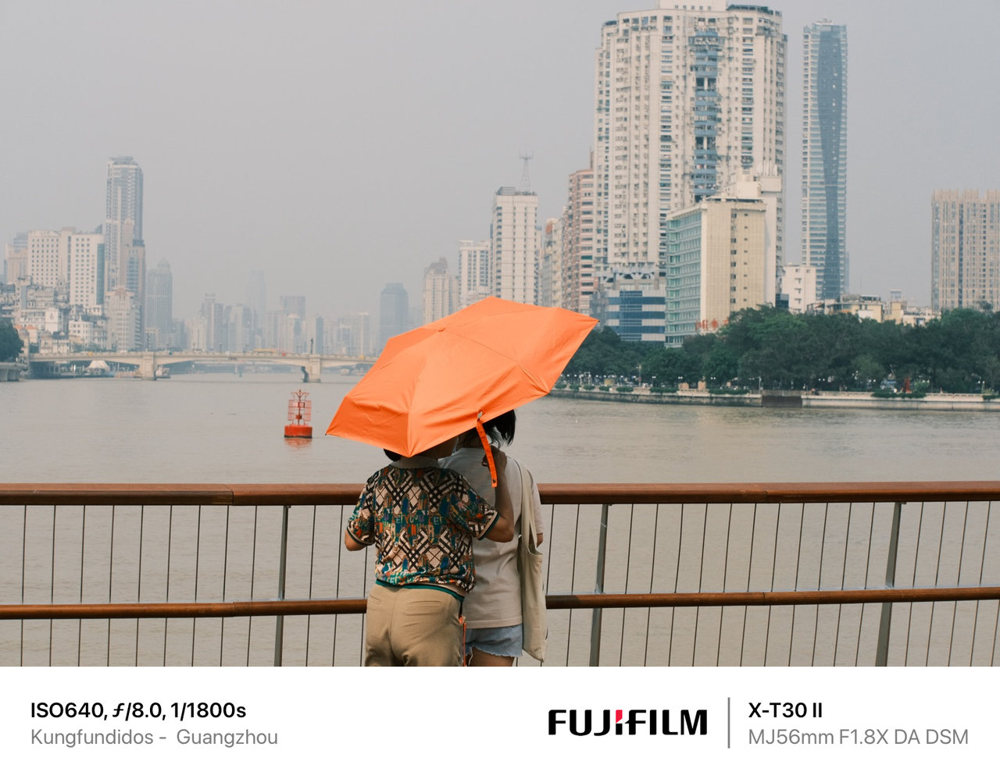
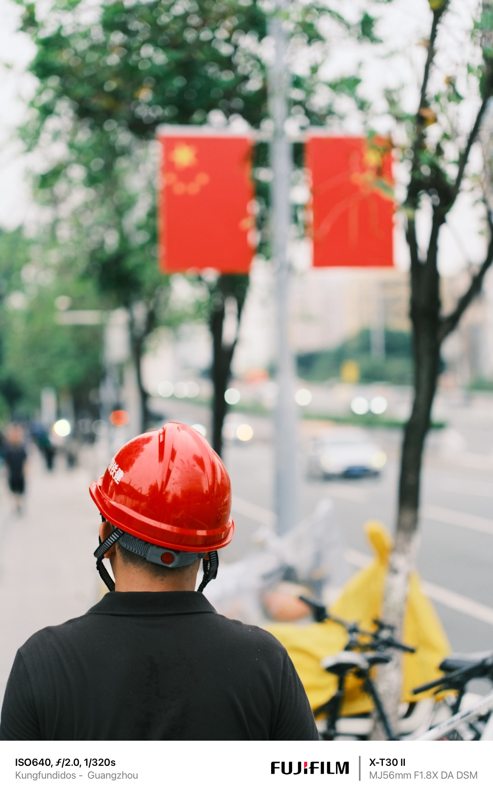

## Introducción

Los fabricantes chinos de ópticas están viviendo una auténtica edad de oro. La oferta de objetivos con autoenfoque que tenemos en la actualidad era impensable hace apenas 5 años. TTArtisan me ha facilitado su **AF 56mm F1.8** para ponerlo a prueba en un entorno real: las caóticas y vibrantes calles de **Guangzhou**.

Este es un objetivo que aterriza en un terreno "minado". La focal de 56mm (equivalente a **85mm en Full Frame**) es el estándar para retratos, y en el sistema Fujifilm ya tenemos gigantes establecidos: el nítido Sigma 56mm f/1.4, el económico Viltrox, o el legendario (y caro) Fujinon XF 56mm f/1.2.

**Nota de transparencia:** No soy un técnico de laboratorio ni un fotógrafo de estudio. Soy un amante de la fotografía callejera. Mi análisis no busca contar líneas de resolución, sino ofrecer una exploración honesta de cómo esta herramienta se comporta en la calle. ¿Puede un objetivo "low cost" satisfacer las necesidades de rapidez y precisión que exige China? Vamos a verlo.

## Ficha Técnica Rápida

| Característica | Especificación |
| :--- | :--- |
| **Focal** | 56mm (aprox. 85mm equiv. en Full Frame) |
| **Apertura** | F1.8 - F16 |
| **Hojas de diafragma** | 9 hojas |
| **Construcción óptica** | 10 elementos en 9 grupos |
| **Distancia mín. enfoque** | 0.5 metros |
| **Diámetro de filtro** | 52mm |
| **Peso** | ~233g |
| **Montura probada** | Fujifilm X |

---

## Construcción y Diseño: Solidez inesperada (3.5/5)

### Sensaciones y Materiales
Mi primera impresión al sacar el TTArtisan AF 56mm F1.8 de la caja fue de sorpresa. A diferencia de las primeras versiones de objetivos económicos de marcas como Viltrox o Yongnuo que abusaban del plástico, aquí encontramos una **construcción totalmente metálica**.

Con un peso de **236g** y unas dimensiones contenidas, se siente denso y robusto, pero no pesado. Equilibra perfectamente en cuerpos como la X-T4 o la X-S20. Si bien es compacto, es imposible alcanzar la miniaturización extrema del **Fujinon XF 50mm f/2** (el "fujicron"), pero para ser un f/1.8, el tamaño es más que correcto.

### Ergonomía y la gran ausencia
El anillo de enfoque es amplio, metálico y tiene una resistencia agradable, ideal si necesitas hacer ajustes manuales precisos. Sin embargo, nos encontramos con el talón de Aquiles de esta serie de objetivos para los usuarios de Fuji: **la falta de anillo de apertura**.
Perder el control físico del diafragma resta puntos a la experiencia "retro" y táctil que buscamos en Fujifilm. Te acostumbras a usar el dial de la cámara, sí, pero se pierde esa inmediatez visual.

### Detalles Extra
* **Parasol:** Incluye un parasol que cumple su función, aunque el encaje podría ser más suave.
* **Conectividad:** Al igual que su hermano de 27mm o 23mm, la tapa trasera incluye un puerto **USB-C** para actualizar el firmware. Un detalle brillante que evita tener puertos feos en el barril del objetivo.

---

## Autoenfoque: Luces y Sombras (4/5)

El sistema de enfoque STM (motor paso a paso) ha avanzado mucho.
* **Velocidad:** En exteriores y con buena luz, el enfoque es rápido y silencioso. Para fotografía de retrato posado o situaciones tranquilas, es impecable.
* **Seguimiento (Eye-AF):** La detección de ojos funciona sorprendentemente bien. El objetivo sigue al sujeto sin perderlo en la mayoría de los casos.
* **Puntos débiles:** Comparado con ópticas nativas o con el 23mm f/2, se nota un pelín más lento. En situaciones de bajo contraste o poca luz (noches cerradas), aparece el temido **"focus hunting"** (el objetivo va adelante y atrás antes de confirmar). No es dramático, pero si buscas capturar acción rápida en la noche, puedes perder alguna foto.

---

## Calidad de Imagen (4/5)

La calidad óptica es donde este objetivo da un golpe sobre la mesa. Por el precio que tiene, el rendimiento es absurdo.

### Nitidez
* **Centro:** A **f/1.8**, la nitidez en el centro es excelente. Puedes contar las pestañas de un retrato o las texturas de una pared en la calle.
* **Esquinas:** Como es habitual en esta gama, las esquinas extremas son más suaves a máxima apertura, pero mejoran drásticamente al cerrar a f/2.8 o f/4.
* **Fotografía de Producto:** Mencionaba en la intro que quizás no es ideal para producto. Esto se debe a que su **distancia mínima de enfoque es de 0.5m** (algo larga para objetos pequeños) y a que necesitas cerrar bastante el diafragma para tener nitidez clínica en todo el plano.

### Aberraciones Cromáticas
En situaciones de alto contraste (ramas contra el cielo brillante), se aprecian algunas **franjas púrpuras o verdes** (aberración cromática longitudinal). Es fácil de corregir en Lightroom, pero está ahí. Es el precio a pagar por una apertura rápida a bajo coste.

---

## Carácter y Bokeh

Al ser un teleobjetivo corto (85mm equiv.), la compresión y el desenfoque son sus principales atractivos. El bokeh es suave y cremoso, ayudando a aislar al sujeto del caos de la ciudad.
En los bordes, las luces desenfocadas toman forma de "ojo de gato" (cat's eye), lo que le da un **look vintage o "swirly"** (arremolinado) que puede resultar nervioso para los puristas, pero que a mí me parece que aporta personalidad y dinamismo a las fotos callejeras.

---

## Comparativa: ¿Dónde se sitúa?

| | TTArtisan 56mm f/1.8 | Sigma 56mm f/1.4 | Fuji XF 50mm f/2 WR |
| :--- | :---: | :---: | :---: |
| **Precio Aprox.** | ~150€ | ~400€ | ~450€ |
| **Luminosidad** | f/1.8 | f/1.4 (Más luminoso) | f/2.0 (Menos luminoso) |
| **Anillo Apertura** | No | No | Sí |
| **Sellado (WR)** | No | Sí (Montura) | Sí (Completo) |
| **Nitidez** | Muy buena | Excelente (Referencia) | Muy buena |

El **Sigma** es técnicamente mejor (más nítido, más rápido), pero cuesta casi el triple. El **Fuji 50mm f/2** es más pequeño y sellado, pero menos luminoso y más caro. El TTArtisan se queda en un punto dulce de precio/rendimiento imbatible.

---

## Pros y Contras

### Lo Mejor
* ✅ **Relación Calidad-Precio:** Insuperable ahora mismo.
* ✅ **Construcción:** Metal sólido y sensación duradera.
* ✅ **Nitidez Central:** Totalmente usable desde f/1.8.
* ✅ **Tamaño:** Compacto y discreto para ser un tele corto.

### A Mejorar
* ❌ **Sin Anillo de Apertura:** Se pierde la esencia de uso de Fuji.
* ❌ **Parasol:** El encaje podría ser mejor.
* ❌ **AF en Poca Luz:** Puede dudar en situaciones críticas.
* ❌ **Distancia Mínima de Enfoque:** 0.5m limita un poco los planos detalle.

---

## Conclusiones

Después de pasar tiempo con el **TTArtisan AF 56mm F1.8** en Guangzhou, siento que he encontrado un compañero de viaje muy capaz. No es un objetivo "perfecto": carece de la velocidad clínica de un motor lineal o del sellado contra el clima de un objetivo profesional.

Pero, ¿necesitas eso? Si eres un fotógrafo aficionado, un estudiante, o simplemente quieres añadir un objetivo de retratos a tu mochila sin tener que comer arroz blanco todo el mes para pagarlo, este objetivo es una compra maestra.

Combina un enfoque competente, una calidad de imagen que sorprende y un precio espectacular. **Es, posiblemente, la mejor puerta de entrada al mundo del retrato y la fotografía callejera de teleobjetivo corto en el sistema Fuji X.**

**Puntuación Final: 8/10**

---