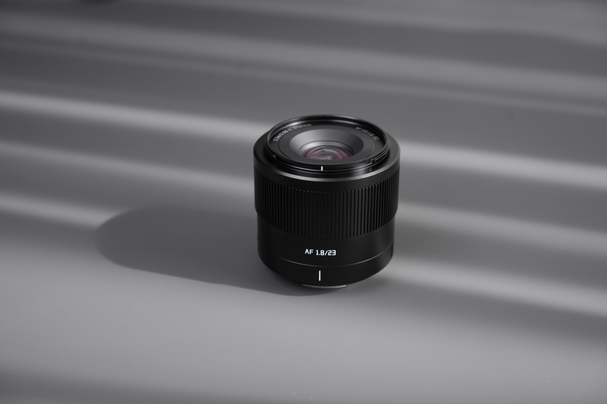
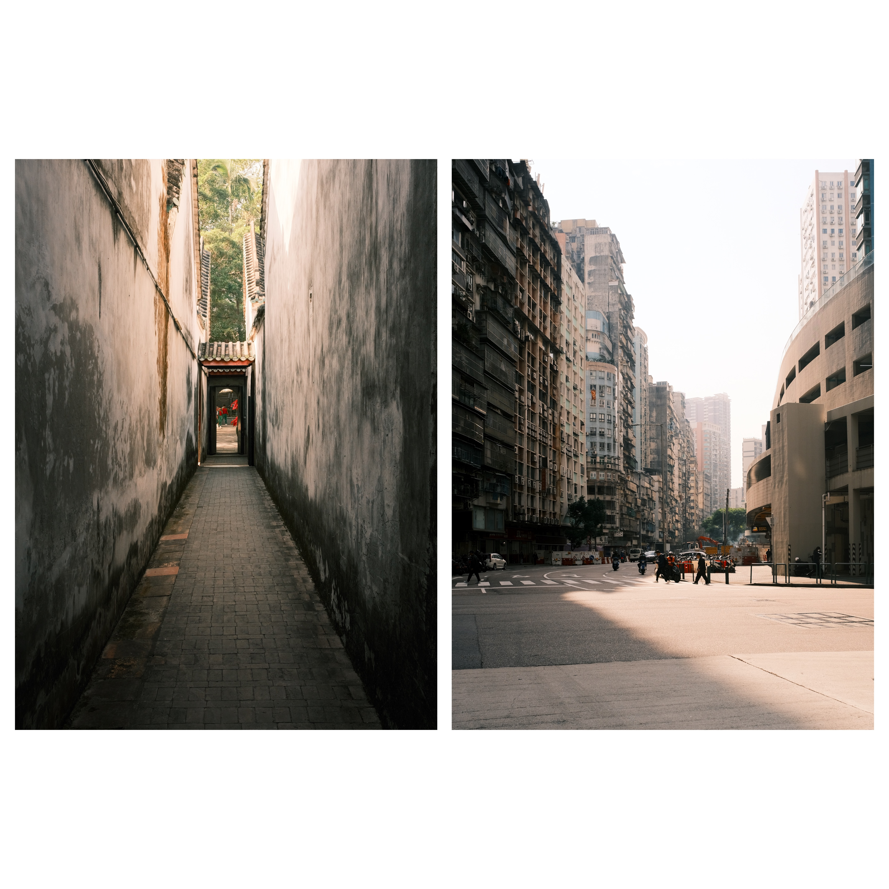
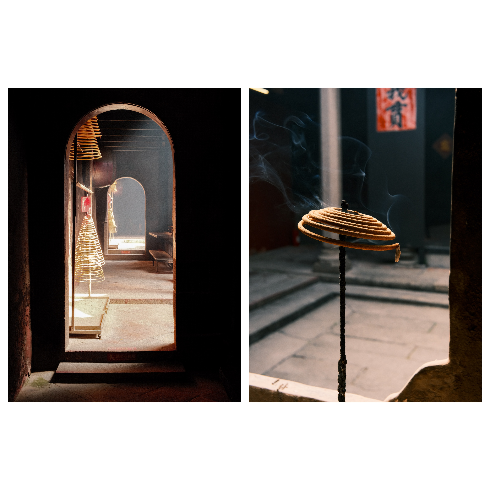

## 前言

作为一个在**广州和澳门**街头游走了数周的业余街头摄影师，我一直在寻找画质、便携性和隐蔽性之间的平衡。在街头摄影（以及纪实摄影）中，35mm（**APS-C画幅等效 23mm**）无疑是“黄金焦段”：既够广能交代环境，又够长能突出主体。

铭匠（TTArtisan）凭借其全新的 **AF 23mm f/1.8** 强势进入自动对焦市场。这颗镜头售价仅约 **127欧元**（国内售价约800-900元人民币），承诺让这个经典焦段变得更加亲民。说实话，作为习惯了富士原厂 XF 23mm f/2 的用户，我最初的期望值并不高。然而，在从夜市到现代建筑的各种实战场景中测试后，这颗小镜头给了我惊喜。

下面，我将逐点分析这颗镜头是否值得放入你的摄影包。

## 快速参数一览

| 特性 | 规格 |
| :--- | :--- |
| **焦距** | 23mm (全画幅等效约 35mm) |
| **光圈** | F1.8 - F16 |
| **光圈叶片** | 9 片 |
| **光学结构** | 8组10片 |
| **最近对焦距离** | 0.3 米 |
| **滤镜口径** | 52mm |
| **重量** | ~223g |
| **测试卡口** | Fujifilm X |

---

## 做工与设计：上手体验 (3.5/5)

### 材质与做工
从盒子里拿出镜头的第一感觉就是冰凉的触感。**全金属镜身**带来的扎实感远超同价位预期。重量仅 **220g** 出头，拿在手里虽轻便但有分量感，尤其搭配富士 X-T 或 X-S 系列机身时，平衡感极佳。

不同于其他国产厂商在入门线上使用塑料材质，铭匠延续了其手动镜头的品质标准。这赋予了它一种“高级感”，也让人对日常使用的耐用性更有信心。

### 操控与缺憾
设计极简紧凑，非常适合低调拍摄。然而，有一个“绕不开的问题”：**没有光圈环**。
对于习惯了在镜头上调节光圈的富士用户来说，这需要一段时间来适应改用机身波轮控制。我理解这是为了控制成本和体积做出的妥协，但这确实是用户体验上最大的牺牲。

### 配件与细节
* **遮光罩：** 随附的方形遮光罩虽然是塑料的，但造型美观且实用，能有效保护前镜组并防止杂光。
* **滤镜：** **52mm** 的口径非常标准且经济，还能与该品牌其他镜头（如 AF 56mm f/1.8）共用滤镜，简化了旅行装备。
* **后盖 USB-C 接口：** 铭匠的一个巧妙设计是将固件升级接口做在了镜头后盖上，避免了在镜身上开孔影响美观。

---

## 自动对焦：街头实战表现 (4/5)

在我的扫街过程中，STM（步进马达）表现称职。
* **速度：** 光线充足时，对焦迅速果断。虽然没有富士最新线性马达那种瞬间“咬合”的极致速度，但应付**街头摄影**绰绰有余。
* **噪音：** **非常安静**。除非你在安静的房间里把耳朵贴在镜头上，否则几乎听不到声音。这对不打扰被摄者至关重要。
* **追踪 (眼部对焦)：** 配合相机的眼部识别功能，表现出人意料地好。
* **暗光环境：** 这是它与 3000 元以上镜头的差距所在。在澳门的夜晚，偶尔会出现轻微的“拉风箱”现象（犹豫）才能锁定主体，虽然这种情况比我预想的要少。

*在这张抓拍中，对焦毫无压力地捕捉到了动态瞬间。*

---

## 画质与光学性能 (4/5)

这是铭匠 23mm f/1.8 证明其身价的地方。它的成像带有一种现代“手术刀式”镜头所缺乏的独特味道。

### 锐度
* **中心：** 在 **f/1.8** 全开下，中心锐度惊人。你可以放心全开使用。
* **边缘：** 不出所料，大光圈下边缘画质有所下降，显得偏软。
* **甜点光圈：** 收缩到 **f/4 或 f/5.6** 时，整个画面的锐度变得非常出色。老实说，对于主体通常在中心或三分线处的街头摄影，f/1.8 边缘的松散并不重要。

### 色彩与反差
这颗镜头的发色倾向于比富士原厂稍暖且饱和度略高，我个人很喜欢这种风格。反差良好，但在强逆光下可能会出现轻微的“雾化”（Veiling Glare），这引出了下一点。

---

## 镜头个性：焦外、暗角与缺陷

### 焦外 (Bokeh)
得益于 f/1.8 光圈和 9 片光圈叶片，主体分离感良好。焦外具有独特的个性，不是那种高端人像头奶油般的化开，而是略带**“焦外旋焦”或纹理感**。对我来说这并非缺陷，反而为照片增添了一种有机的“复古味”，非常适合人文题材。

### 暗角 (Vignetting)
**f/1.8 时暗角非常明显**。这是坏事吗？技术上说是。但在艺术上？看情况。在我的街头照片中，自然的暗角有助于将视线集中在主体上，省去了后期添加的步骤。收到 f/2.8 后暗角会大幅减少。

### 色散 (CA)
铭匠在这里做得很好。纵向色差（高反差边缘的紫边或绿边）控制得很到位。即使在广州对着高光天空拍摄树枝，色边也微乎其微。

### 眩光与逆光
逆光表现尚可。直对阳光时会出现一些光斑（Flare），但通常比较好看且可控，除非你故意找茬，否则不会破坏画面反差。

---

## 快速对比

| | 铭匠 (TTArtisan) 23mm f/1.8 | 富士 (Fuji) XF 23mm f/2 WR |
| :--- | :---: | :---: |
| **参考价格** | ~127€ (约¥900) | ~450€ (约¥3000) |
| **最大光圈** | f/1.8 | f/2.0 |
| **光圈环** | 无 | 有 |
| **全天候防护 (WR)** | 无 | 有 |
| **体积** | 紧凑 | 极紧凑 |

---

## 优缺点总结

### 我喜欢的地方 (Pros)
* ✅ **无敌性价比：** 这个价格的画质表现令人难以置信。
* ✅ **全金属做工：** 手感像严肃的工具，而不是玩具。
* ✅ **中心锐度：** f/1.8 全开完全可用。
* ✅ **便携性：** 挂脖子上一整天无负担。
* ✅ **USB-C 接口：** 通过后盖升级固件非常方便。

### 有待改进的地方 (Contras)
* ❌ **无光圈环：** 在富士系统上确实很怀念这个功能。
* ❌ **边缘偏软：** f/1.8 拍风景不太理想，需要收光圈。
* ❌ **暗光对焦：** 在极低反差环境下会犹豫。
* ❌ **明显暗角：** 虽说是风格，但全开时确实很重。

---

## 结论

**铭匠 AF 23mm f/1.8** 改变了我对“廉价镜头”的看法。它不完美：如果你需要防尘防滴、极致的对焦速度或全开光圈下边缘如刀锋般锐利，那你得花三四倍的价钱去买富士原厂。

但对于**街头摄影师、纪实摄影师或旅行者**来说，如果想找第二支备用镜头，或者是预算有限但想尝试大光圈定焦的新手，这颗镜头绝对是个宝藏。它的“缺陷”（如暗角或焦外特性）赋予了它性格，而它的优点（做工、体积和价格）让它极具吸引力。

它能替代 XF 23mm f/1.4 吗？不能。但它能以几分之一的价格让你拍出 95% 的好照片吗？**绝对可以。**

**最终评分：8.5/10 (基于价格考量)**

---