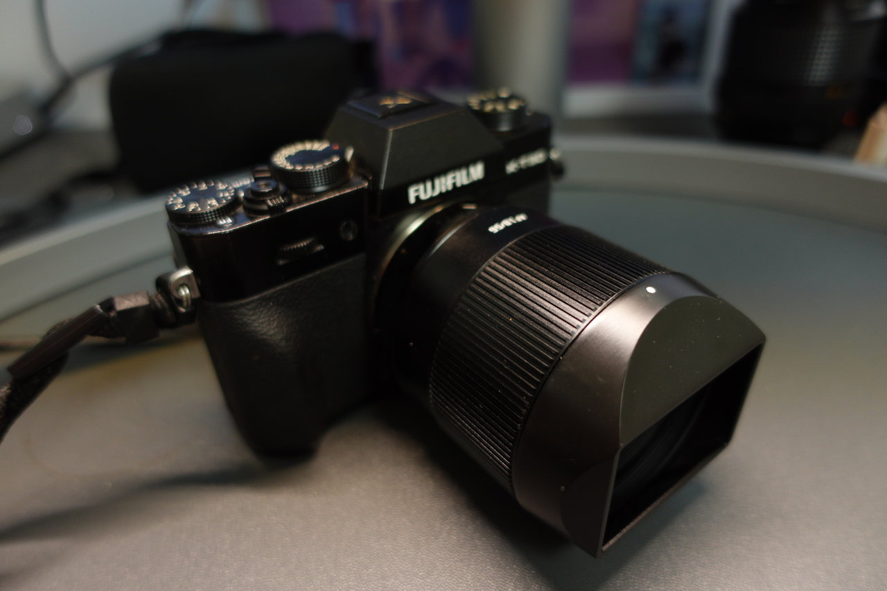
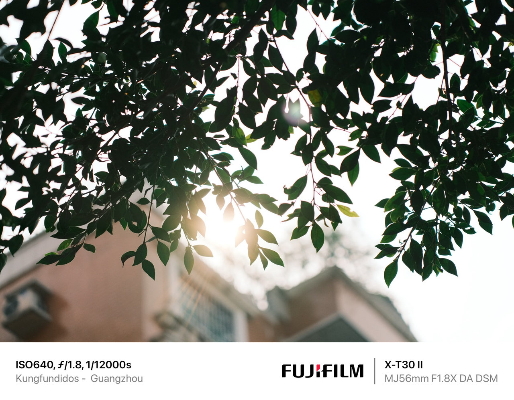

## 引言

中国镜头制造商正在加快步伐，目前市面上的自动对焦镜头供应在5年前是难以想象的。TTartisan为我提供了他们的TTartisan AF 56mm F1.8，让我在广州的街头进行测试。我觉得这款镜头非常有趣，尽管在这个焦段我们已经有了来自适马、美科或者出色的富士XF56 F1.2（虽然这款价格要贵得多）等多个选择。

需要说明的是，我不是专业摄影师，只是一个街头摄影爱好者，所以不要期待一个非常技术性的评测，而是一个诚实地探索这款镜头如何适应我作为街头摄影师需求的评测。毕竟，那些因工作或爱好需要最高画质和锐度的人，最终总会选择购买"原厂"镜头，而不是选择更经济的选择。这款镜头能否满足我在中国繁忙街头的需求呢？

## 构造和设计 (3.5/5)

我对TTArtisan AF 56mm F1.8的第一印象是它看起来结实且相对紧凑。尺寸为直径65毫米，长度62毫米，TTArtisan AF 56mm F1.8的尺寸对于56毫米镜头来说是相当可以接受的。当然，不可能达到富士XF50 f2那样的紧凑程度。此外，这款镜头也不是很重，重量为236克，所以不会导致手部疲劳。

TTArtisan AF 56mm F1.8的一个显著特点是其金属构造，这与其他制造商如唯卓诚在其经济型镜头中选择塑料材质不同。这增加了质量感，给人一种更耐用和坚固的感觉。

手动对焦环感觉非常舒适，触感反馈相当不错。它没有从自动对焦切换到手动对焦的开关，但我认为这不是一个大问题，因为大多数富士相机机身上都有这个开关。

但我确实看到光圈环的缺失是一个问题。我认为我们中很多人选择富士相机是因为它的手动控制，对我来说这一点很关键，特别是在街拍时会失去很多可用性。

## 自动对焦 (4/5)

TTArtisan AF 56mm F1.8提供相当不错的自动对焦，虽然相比23mm F2，我注意到了一些不足。虽然对焦速度很快，但比富士镜头稍慢，而且我注意到在弱光条件下会有一些"对焦游走"的现象。

## 图像质量和光学性能：(4/5)

TTArtisan AF 56mm F1.8提供的图像质量令人印象深刻，超出了我的期望，特别是考虑到它的价格。在广州繁忙的街头测试期间，即使在f1.8光圈下，中心锐度也让我印象深刻。

## 散景

这款镜头的散景表现相当均匀，变形最小，产生令人愉悦且具有美感的散景效果。但是在远距离时可能会变得有点躁动。对某些人来说，这可能是一个优点。

## 结论

在广州街头与这款镜头相处一段时间后，我感觉找到了一个新的摄影伙伴，至少是暂时的。我不是专家，但正如我所说，这款镜头超出了我的期望。

很明显，这款镜头在各种情况下都表现出色，尽管在产品摄影方面可能稍有不足。它结合了良好的对焦性能、出色的图像质量和令人惊叹的价格。对于寻找一款好用、美观且实惠的镜头的摄影师来说，TTArtisan AF 56mm F1.8是一个值得考虑的选择。
